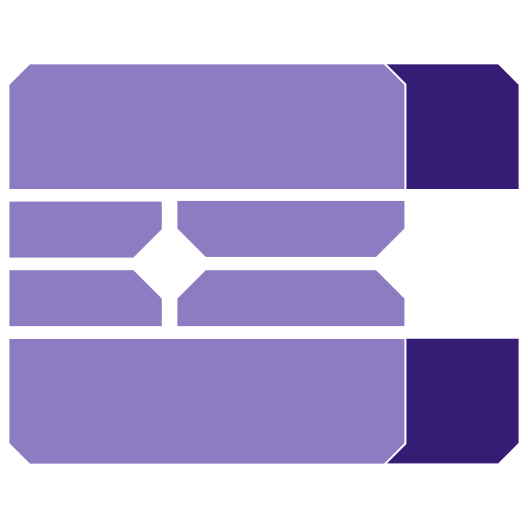

# The ePUx16 System

 

### Overview
- The ePUx16 System is a computer built for the eBin Bytecode, and is built with Java as metacode.
- This project was made as a fun experiment. It is inspired by the various iterations of Excel Computers seen on Youtube, but has since transformed into a separate concept entirely.

 

### Features
- The features of the ePUx16 Architecture are:
   - full eBF/Hades/eBin language support with 20+ different symbols/commands tailored around the development of low-level systems, including operating systems
   - Java (soon 2B Niva) as metacode (planned to allow for extensibility through `.jar` files)
   - full CPU chip, RAM chip, ROM chip, and ALU chip
   - User input
   - Graphical output (a screen)

 <!-- add pictures of code, diagrams, and screenshots of images in the computer running here -->
