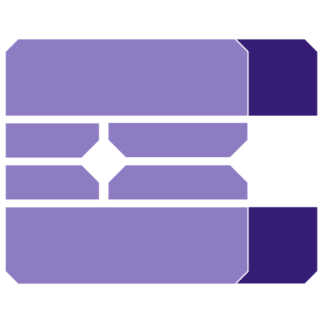

# The Chronos VM x32 System

 

### To-do list
- Create a custom error type and implement pretty-print for the type, as well as using it in `Result` enums instead of returning `Option`s
- Add a REPL/Debug mode, allowing for runtime debugging of the VM, and also allow for a variety of CLI options to be passed to increase verbosity to identify bugs
- Add a crashdump format and0 a simple crashdump reader, so information relating to faulty executions can be retrieved after executions and read (also, create this by default)
- Implement minifb framebuffer
- Implement crossterm for simple I/O
- Add flags to disable/enable features such as the framebuffer or I/O
- Add benchmarking flags to allow for overall program performance information

### Overview
- The Chronos VM x32 System is a computer built for the Gaia Bytecode, and is built with Java as metacode.
- This project was made as a fun experiment. It is inspired by the various iterations of Excel Computers seen on Youtube, but has since transformed into a separate concept entirely.

 

### Features
- The features of the Chronos VM x32 Architecture are:
   - full eBF/Hades/Gaia language support with 20+ different symbols/commands tailored around the development of low-level systems, including operating systems
   - Java (soon 2B Niva) as metacode (planned to allow for extensibility through `.jar` files)
   - full CPU chip, RAM chip, ROM chip, and ALU chip
   - User input (keyboard input, mouse movement, mouse input, etc.)
   - Graphical output (a screen)
   - Multi-threaded system
     - Render thread
     - OS thread
     - General process threads

 <!-- add pictures of code, diagrams, and screenshots of images in the computer running here -->
